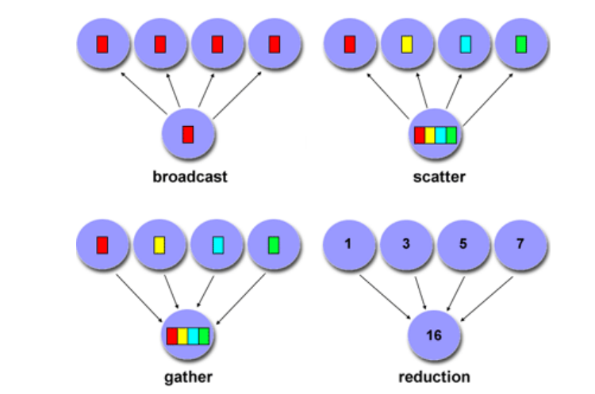

# mpi_tut

## Command to run
mpirun -n 3 python ptp.py

## Relevant docs -
http://mpi4py.readthedocs.io/en/stable/overview.html

http://johnfoster.pge.utexas.edu/PGE383-AdvGeomechanics/notes/MPI.pdf

http://mpi4py.readthedocs.io/en/stable/tutorial.html

http://mpitutorial.com/tutorials/mpi-scatter-gather-and-allgather/

http://etutorials.org/Linux+systems/cluster+computing+with+linux/Part+II+Parallel+Programming/Chapter+9+Advanced+Topics+in+MPI+Programming/ (Lots of stuff on parallel computing)

Basic steps for paralellising work using master-worker architechture

